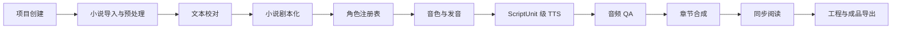

# VoxWeaver（声织）

VoxWeaver 是面向长篇小说和其他叙事文本的多角色有声内容生产工程。系统围绕可追踪文本、结构化剧本、角色与音色、中文发音、片段生成、自动 QA、人工审核、章节装配、同步阅读和工程导出构建。

## 核心流程

## 核心原则

- 原始文件不可覆盖；
- source_asset、extracted/raw、canonical、normalized、corrected、script、spoken 分层管理；
- 格式、外部 LLM/TTS/ASR 等 Provider API 和音频后端通过端口与适配器接入；
- ScriptUnit 是最小剧本、审核和音频生成单元；
- 每个正式产物保存输入、处理器、参数、版本、哈希和审核信息；
- 前序变化只使实际依赖的后续产物过期，旧产物保留；
- AI 输出结构化候选，低置信度和高风险结论进入人工审核；
- 未确认授权的小说、声音、模型和素材不得进入正式生产和发布。
