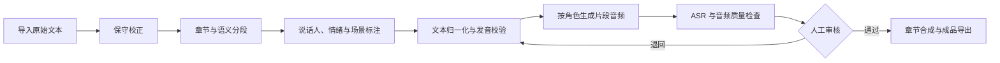

# VoxWeaver（声织）

VoxWeaver 是一个面向长篇小说、剧本和其他叙事文本的多角色有声内容生产工具。它把文本校正、说话人识别、发音控制、角色音色编排、分段合成、自动质检、人工审核和成品导出组织成可追踪、可重试的流水线。

> 当前状态：方案与目录骨架阶段，尚无可运行实现。

## 项目目标

- 保留原文，并将校正文、朗读文本与原文分开管理。
- 识别旁白、角色台词、内心独白及其说话人和情绪。
- 通过术语库、文本归一化和发音词典处理专有名词、多音字、数字和单位。
- 为旁白、主要角色、次要角色和群体角色分配不同音色。
- 以短语义片段为最小生成、审核和重试单位。
- 使用 ASR 回听、音频指标和人工复核共同控制质量。
- 保留完整生成元数据，使任意片段可复现、替换和重新导出。

## 非目标

- 不承诺全自动、零人工校对地完成整部长篇作品。
- 不内置或分发未经授权的小说、动画音轨、真人声音、模型权重。
- 不将某个 TTS、ASR、LLM 或前端框架固化为唯一实现。
- 不把说话人聚类标签直接视为真实角色身份；角色映射需要上下文校验或人工确认。

## 核心流程



### 1. 文本导入

优先支持 EPUB、TXT 和 Markdown。扫描 PDF 需要先经过 OCR，并保留页码或来源定位信息。

同一内容至少保留三层：

| 文本层 | 用途 | 修改规则 |
|---|---|---|
| `original` | 原始证据与回溯基线 | 永不覆盖 |
| `corrected` | 确定性错别字、漏字、重复字和标点修正 | 每项修改可审计 |
| `spoken` | 真正送入 TTS 的朗读文本 | 允许数字、单位和发音友好改写 |

### 2. 全书知识库

知识库至少包含：

- 人物、别名、性别、年龄阶段和默认表达风格；
- 门派、地名、功法、法宝、丹药、妖兽和境界；
- 固定读音、禁改词和上下文相关读音；
- 角色出场范围、关系及称谓。

所有自动校正和说话人识别都必须优先使用当前项目的知识库，避免同一实体跨章节漂移。

### 3. 保守校正

校正器只自动应用高置信度、可解释的修改，不润色、不改写句式、不改变作者文风。每项修改记录原文、修正文、理由、置信度和词典版本；低置信度修改进入人工队列。

### 4. 结构化脚本

推荐的最小片段记录：

```json
{
  "chapter_id": "ch001",
  "segment_id": "ch001-000042",
  "type": "dialogue",
  "speaker_id": "character_han_li",
  "text": "此物在下志在必得。",
  "spoken_text": "此物在下志在必得。",
  "emotion": "calm_alert",
  "speed": 0.94,
  "volume": 0.96,
  "pause_after_ms": 420,
  "speaker_confidence": 0.97,
  "status": "PRONUNCIATION_CHECKED"
}
```

建议采用两遍说话人处理：

1. 抽取直接对话、旁白、内心独白、说话人、情绪和关联动作。
2. 根据角色是否在场、连续对话轮次、称谓、时间线和首次出场位置进行校验。

低置信度、多人重叠、传音、梦境、回忆、嵌套转述和连续无明确说话人的片段进入人工审核。

### 5. 中文文本前端

处理优先级：

1. 数字、日期、单位和缩写的规则归一化；
2. 基于上下文的多音字判定；
3. 项目术语词典覆盖；
4. 人工确认后的全书锁定；
5. 合成后 ASR 回检。

PaddleSpeech 提供中文文本前端，包含文本归一化、G2P、多音字和变调等能力，可作为候选实现：

https://paddlespeech.readthedocs.io/en/latest/tts/zh_text_frontend.html

### 6. 音色与 TTS

建议按角色重要度分层：

- 旁白：稳定、明确授权或原创的固定音色；
- 主要角色：经过审核的专用音色配置，可选择微调；
- 次要角色：零样本克隆或可复用的原创音色；
- 临时角色和群体角色：按年龄、性格、性别表达等维度维护通用音色池。

首批候选后端：

- Qwen3-TTS：官方项目提供声音克隆、声音设计、指令控制和微调入口。  
  https://github.com/QwenLM/Qwen3-TTS
- GPT-SoVITS：候选的少样本角色音色后端，并提供相关数据处理工具。  
  https://github.com/RVC-Boss/GPT-SoVITS

VoxWeaver 通过适配器接入后端。脚本、角色、审核状态和导出逻辑不得依赖某个模型的私有字段。

### 7. 角色参考音频

参考音频处理链：

```text
合法取得的音频
→ 提取无损音轨
→ 人声与背景声分离
→ VAD 切片
→ ASR 转写
→ 说话人聚类
→ 字幕和画面辅助匹配
→ 人工确认角色
→ 质量分级并登记来源
```

说话人 diarization 只回答“谁在什么时候说话”，输出通常是匿名标签，并不自动确认真实人物身份。pyannote.audio 官方示例同样输出 `SPEAKER_00` 等标签：

https://github.com/pyannote/pyannote-audio

以下片段默认拒绝进入角色音色库：多人重叠、明显音乐或音效覆盖、强混响、句子残缺、极端喊叫、变声特效、字幕与实际台词不一致。

### 8. 分段生成与可复现性

不按整章一次性生成。每个完整语义单元独立生成并记录：

```json
{
  "segment_id": "ch001-000042",
  "text_hash": "sha256:...",
  "speaker_profile_version": "han_li:v3",
  "engine": "qwen3-tts",
  "engine_version": "pinned-version",
  "reference_audio_id": "han_li:calm:03",
  "seed": 183722,
  "pronunciation_dict_version": "2026-07-30",
  "status": "APPROVED"
}
```

模型版本、参考音频、采样参数、随机种子策略、响度处理和发音词典版本必须随生成记录保存。

### 9. 自动质量检查

每个片段至少执行：

- ASR 回听与目标文本比对；
- 人名和专有名词加权检查；
- 漏读、重复、异常插入和数字错误检测；
- 削波、超长静音、首尾截断、响度和时长异常检测；
- 可选的说话人嵌入相似度检查；
- 超过阈值或多次重试的片段转人工审核。

FunASR 官方工具集覆盖 ASR、VAD、标点恢复、说话人相关能力，可作为候选回检后端：

https://github.com/modelscope/FunASR

阈值必须通过样章实测校准，不能把经验值直接视为稳定生产标准。

### 10. 后期与导出

审核通过的 WAV 片段依次执行停顿插入、必要的短淡化、响度统一、章节合成和元数据写入，最后导出 M4B 或 MP3。中间音频使用无损格式，最终发布时再压缩。

FFmpeg 提供音频拼接能力：

https://www.ffmpeg.org/faq.html

TTS-Story 已实现多音色脚本、片段重生成、任务队列、项目库和 M4B 导出，可作为交互与工作流参考，不作为当前架构的强依赖：

https://github.com/Xerophayze/TTS-Story

## 状态机

```text
IMPORTED
→ CORRECTED
→ SPEAKER_TAGGED
→ PRONUNCIATION_CHECKED
→ READY_FOR_TTS
→ GENERATED
→ ASR_CHECKED
→ MANUAL_REVIEWED
→ APPROVED
→ EXPORTED
```

任何状态变更都应记录操作者、时间、输入版本、输出版本和失败原因。退回时保留历史产物，不覆盖已审核版本。

## 目录结构

```text
voxweaver/
├── apps/
│   └── web/                    # 审核、角色管理和任务监控界面
├── services/
│   └── api/                    # 项目、脚本、任务和资产 API
├── workers/
│   ├── text/                   # 校正、抽取、分段和发音任务
│   ├── speech/                 # TTS、ASR 和说话人分析任务
│   └── audio/                  # 音频 QA、合成和导出任务
├── packages/
│   ├── contracts/              # 跨服务数据结构和状态定义
│   ├── text-pipeline/          # 文本导入、校正和分段
│   ├── speaker-analysis/       # 台词归属与说话人校验
│   ├── pronunciation/          # TN、G2P 和术语词典
│   ├── tts-engine/             # TTS 统一接口和适配器
│   ├── asr-engine/             # ASR 统一接口和适配器
│   └── audio-processing/       # 切片、检测、响度和合成
├── configs/
│   ├── engines/                # 后端配置模板
│   └── policies/               # 阈值、审核和重试策略
├── data/
│   ├── books/
│   │   ├── original/           # 原始输入，只读
│   │   ├── corrected/          # 校正文
│   │   └── spoken/             # 朗读文本
│   ├── knowledge/              # 人物、实体、别名和发音词典
│   ├── scripts/
│   │   ├── chapters/           # 结构化章节脚本
│   │   └── review-queue/       # 待人工复核项
│   ├── voices/                 # 已授权参考音频及其元数据
│   ├── generated/
│   │   ├── raw/                # 原始生成片段
│   │   ├── approved/           # 审核通过片段
│   │   └── rejected/           # 拒绝片段
│   ├── chapters/               # 合成后的章节音频
│   └── exports/                # 最终 M4B/MP3
├── models/                     # 本地模型挂载点，不提交权重
├── docs/
│   ├── adr/                    # 架构决策记录
│   └── schemas/                # JSON Schema/OpenAPI 等
├── infra/
│   └── docker/                 # 容器与部署配置
├── tests/
│   ├── fixtures/               # 可公开、可再分发的小型测试夹具
│   ├── integration/
│   └── e2e/
├── README.md
├── PLAN.md
└── .gitignore
```

`data/` 下的内容默认不进入版本控制，仅保留目录占位和可公开示例。可共享的测试数据放入 `tests/fixtures/`，并记录许可和来源。

## 数据与授权边界

使用者必须确认输入文本、参考音频、声音模型和最终发布方式均具备所需授权。中国现行《民法典》第一千零二十三条规定，自然人声音的保护参照适用肖像权保护规则：

https://www.samr.gov.cn/zw/zfxxgk/fdzdgknr/bgt/art/2023/art_60fb3863b7364b759123a42d1df568ca.html

中国现行《著作权法》将复制、表演、信息网络传播和改编等列为著作权相关权利，并对使用已有作品制作录音录像制品等情形作出规定：

https://www.npc.gov.cn/c2/c30834/202011/t20201119_308796.html

因此，本项目默认使用原创、公共领域或取得明确许可的文本和音色。购买书籍、订阅视频服务或能够访问某段音频，不应在项目设计中被当作已获得改编、复制、声音使用或公开传播授权。具体项目的授权范围应由权利人文件和专业法律意见确认。

## 开发入口

当前尚未选择语言版本、包管理器、数据库、队列和部署方式。第一阶段完成技术 ADR 与样章验收标准后，再添加安装和运行命令。实施顺序见 [PLAN.md](./PLAN.md)。

