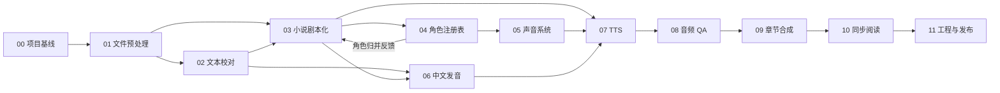

# VoxWeaver 阶段规格索引

状态：正式阶段规格入口
更新日期：2026-08-08

## 1. 文档权威关系

下图定义本目录采用的完整权威顺序。低层文件不得静默覆盖高层文件；冲突无法通过收窄范围解决时停止实施。各里程碑执行规格在自身文件中内化 Decision Gate、任务派发、文件占用、验证和交接规则。

```text
AGENTS.md
  仓库协作、安全与范围保护
        ↓
项目计划.md
  产品目标、范围、MVP 和阶段顺序
        ↓
docs/spec/README.md + docs/spec/00～11 + docs/spec/90
  可执行范围、输入输出、依赖、迁移和验收
        ↓
docs/adr/
  已接受技术选型
        ↓
docs/schemas/
  机器可校验契约
        ↓
docs/milestones/ + 任务卡
  原子实现、文件白名单和验收
```

- `README.md` 只提供项目入口和当前状态。
- `docs/ideas/` 只保存未确认实施的想法，不得自动进入本目录。
- 阶段文件与 `项目计划.md` 冲突时，先停止实施并修订低位的阶段规格；若确需改变产品范围，必须由项目负责人明确批准后再修改项目主计划。不得由阶段文件静默扩展产品范围。

本文及各阶段文件中的“必须”“不得”“应该”“可以”分别表示强制、禁止、推荐和可选要求。用词等级参考 RFC 2119：

https://www.rfc-editor.org/info/rfc2119/

## 2. 当前实现审计状态

当前工作区已完成并验证 M0 后端基础设施：项目生命周期和会话、SQLite 状态库、公共记录、Task/StageRun、Artifact revision、依赖图、增量过期、迁移和恢复均有可执行源码与测试。因此：

- M0 项目基础设施记为 `verified`；
- 阶段 00 的 Electron 项目页、最近项目入口和跨进程接线仍未完成，阶段整体保持 `in_progress`；
- 阶段 01～11 仍记为 `unverified`；
- 文档完成不代表功能已经实现；
- 若已有实现位于其他目录或分支，必须先补充路径并逐阶段执行保留、适配、迁移、替换或废弃审计；
- 在审计完成前，不得把早期原型直接标记为阶段完成。

实现审计结论使用以下枚举：

| 状态 | 含义 |
|---|---|
| `verified` | 当前切片具有源码、自动化测试和可复现运行证据 |
| `retain` | 契约和数据不变量均符合，可直接保留 |
| `adapt` | 核心逻辑可复用，但接口或状态模型需要适配 |
| `migrate` | 功能可保留，但已有项目数据必须迁移 |
| `replace` | 违反核心不变量，需要替换实现 |
| `retire` | 已被新范围取消，不再进入正式流程 |
| `unverified` | 未取得实现证据，不能判断 |

## 3. 阶段目录

| 阶段 | 文件 | 主要交付 | 前置阶段 |
|---|---|---|---|
| 00 | [项目基线与工程工作区](./00.项目基线与工程工作区.md) | 项目目录、状态、产物、依赖、任务、迁移 | 无 |
| 01 | [小说导入与文件预处理](./01.小说导入与文件预处理.md) | 格式适配、标准化、章节、Scene、处理 Segment | 00 |
| 02 | [文本校对](./02.文本校对.md) | 可审计校对和人工复核 | 01 |
| 03 | [小说剧本化](./03.小说剧本化.md) | ScriptUnit、叙述类型、说话人候选 | 01、02 |
| 04 | [角色注册表与状态](./04.角色注册表与状态.md) | Character、Alias、Stage、角色归并 | 01、03（迭代） |
| 05 | [声音系统与音色分配](./05.声音系统与音色分配.md) | VoiceProfile、VoicePool、Casting | 04 |
| 06 | [中文发音处理](./06.中文发音处理.md) | spoken 文本、发音词典、人工锁定 | 02、03 |
| 07 | [TTS 生成](./07.TTS生成.md) | TTS 适配器、逐单元生成、缓存 | 03、05、06 |
| 08 | [音频 QA](./08.音频QA.md) | ASR 回检、音频检测、审核与重试 | 07 |
| 09 | [章节合成与基础后期](./09.章节合成与基础后期.md) | Clip、章节音频、基础后期 | 08 |
| 10 | [时间轴与同步阅读](./10.时间轴与同步阅读.md) | 音文时间轴、字幕、阅读器 | 09 |
| 11 | [工程导入导出与发布](./11.工程导入导出与发布.md) | 工程包、重新绑定、发布快照 | 00～10 |
| 90 | [MVP 联调与验收](./90.MVP联调与验收.md) | M0～M8 纵向闭环与量化复盘 | 按里程碑 |

### 3.1 小模型里程碑执行规格

以下文件把里程碑拆成带门禁、前置、读写白名单、验证命令和停止条件的原子任务；它们细化阶段规格，但不替代阶段规格或扩大范围。

| 里程碑 | 执行规格 | 覆盖范围 | 当前入口门禁 |
|---|---|---|---|
| M1 | [小说导入执行规格](../milestones/M1.小说导入执行规格.md) | TXT 导入及 EPUB/Markdown 后续兼容边界 | 阶段 00 桌面入口与跨进程基线完成（M0 后端已 `verified`） |
| M2 | [文本 AI 处理执行规格](../milestones/M2.文本AI处理执行规格.md) | 阶段 01 的 Scene/ProcessingSegment 桥接、02 文本校对、03 小说剧本化、04 角色注册表 | M1 完成，且 M0 后端证据无回退 |
| M3 | [角色系统执行规格](../milestones/M3.角色系统执行规格.md) | 阶段 04、05 的角色稳定 ID、音色与 Scene 分配 | M2 完成 |
| M4 | [语音生成执行规格](../milestones/M4.语音生成执行规格.md) | 阶段 06、07 的 spoken、发音与 TTS | M3 完成 |
| M5 | [音频 QA 执行规格](../milestones/M5.音频QA执行规格.md) | 阶段 08 的检测、审核和回退 | M4 完成 |
| M6 | [章节合成执行规格](../milestones/M6.章节合成执行规格.md) | 阶段 09 的章节装配与基础后期 | M5 完成 |
| M7 | [同步阅读执行规格](../milestones/M7.同步阅读执行规格.md) | 阶段 10 的时间轴、字幕和阅读器 | M6 完成 |
| M8 | [工程导入导出执行规格](../milestones/M8.工程导入导出执行规格.md) | 阶段 11 的工程包、重新绑定和发布 | M7 完成 |

## 4. 依赖关系



阶段编号表示主要交付顺序，不表示所有模块只能串行开发。03 与 04 必须按“说话人候选—角色归并—说话人解析”迭代；05 与 06 可以在各自依赖稳定后并行，但 07 必须同时取得两者的可用版本。

## 5. 统一数据层

所有阶段统一使用以下文本层，不得自行改名或合并：

```text
source_asset       原始文件资产，不可变
extracted/raw      从格式中提取的原始文本与结构
canonical          不改变语义的确定性标准化
normalized         可审计的排版和噪声清洗
corrected          经规则、AI 和人工确认的校正文
script             面向角色和生成的结构化剧本单元
spoken             送入 TTS 的朗读文本与发音表达
```

`ProcessingSegment` 是为模型上下文、并发和恢复而建立的技术分块；`ScriptUnit` 是最小剧本、审核和音频生成单元。两者不得共用 ID 或生命周期。

## 6. 阶段文件模板

每个阶段文件必须包含：

1. 目标和范围；
2. 非目标；
3. 前置条件；
4. 输入与输出契约；
5. 处理流程和任务边界；
6. 页面与人工审核；
7. 版本、依赖和过期影响；
8. 早期实现迁移规则；
9. 测试要求；
10. 验收标准；
11. 已确认策略与仍缺的执行输入；
12. 涉及外部事实或技术判断时附权威依据。

跨进程 DTO、revision manifest 和工程包清单采用 JSON Schema Draft 2020-12；具体 schema 存放在 `docs/schemas/`：

https://json-schema.org/specification

## 7. 范围变更规则

- 新产品想法先进入 `docs/ideas/`。
- 用户明确批准纳入后，先修改 `项目计划.md` 的范围和阶段，再修改对应阶段文件。
- 改变存储布局、核心实体、对外工程格式或后端接口时，必须增加 ADR 和迁移说明。
- 阶段规格不得直接固定未经比较验证的模型、阈值或成本目标。

## 8. 文档职责

| 文档 | 职责 |
|---|---|
| `AGENTS.md` | 保留为协作规则，不承载产品需求 |
| `README.md` | 项目和文档入口 |
| `项目计划.md` | 唯一产品主计划 |
| `docs/spec/README.md`、`docs/spec/00～11`、`docs/spec/90` | 阶段实施与验收规格 |
| `docs/ideas/` | 未确认想法，不并入正式计划 |
| `docs/adr/`、`docs/schemas/` | 已确认技术决策和机器可校验契约 |
