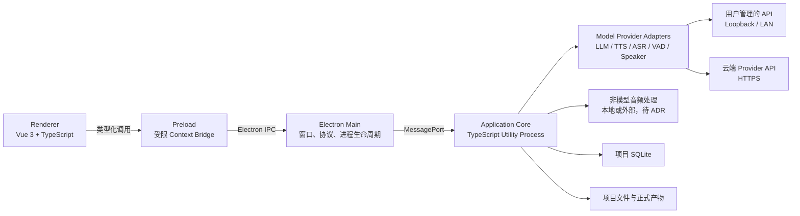

# VoxWeaver Electron 桌面应用架构规格

状态：`draft`

版本：`0.4.0`

日期：2026-08-08

适用范围：桌面端 MVP

对应阶段：[阶段 00：项目基线与工程工作区](../../plan/00.项目基线与工程工作区.md)

## 1. 文档定位

本规格细化 VoxWeaver 桌面端的运行时、语言、进程、通信、目录、任务恢复和安全边界。

本规格当前仍为整体设计草案。[ADR 0001](../adr/0001-model-capabilities-via-provider-apis.md) 已确认模型能力统一通过外部 Provider API 接入，但不表示已经完成以下动作：

- 创建 Electron、Vue 或 Node.js 工程；
- 确认最终依赖版本、包管理器、构建器或 SQLite 驱动；
- 确认首批 LLM、TTS 和 ASR Provider API 及其数据策略；
- 确认非模型音频处理方案；
- 完成目标平台打包和纵向验证。

其余核心选型必须在进入对应实现前通过 ADR 或可复现验证固定，并同步关联阶段计划。

## 2. 目标

- 使用 Electron 提供单一桌面入口、原生目录选择、应用生命周期和安装分发；
- 使用 Vue 3 和 TypeScript 实现可维护的桌面界面；
- 将窗口生命周期、领域工作流、文件/数据库写入和 Provider 调用编排隔离到明确进程边界；
- 所有小说、项目状态、音频和导出产物默认保存在用户本地；
- LLM、TTS、ASR、VAD 和说话人分析等模型能力统一通过可替换 Provider API 接入；
- 应用不运行、下载、加载或托管模型，不随安装包分发模型权重或 Python 运行时；
- 共享 Provider 基础设施可以连接用户管理的 loopback/LAN 服务或云厂商官方服务；
- Provider 请求取消、失败或应用重启后可判定恢复范围，不要求重跑整章；
- 第一版不启动 VoxWeaver 自身的 localhost HTTP 服务，不开放入站网络 API；
- 不开发独立网页端；Vue Renderer 只在 Electron 桌面应用内交付；
- 保留未来增加 CLI 或自动化 HTTP 适配器的应用边界，但不由此派生网页端。

## 3. 非目标

- 不把所有逻辑放进 Electron main 或 renderer；
- 不在 renderer 中启用 Node.js integration；
- 不在 Electron 进程消息中传输完整音频二进制或大段文件内容；
- 不在 VoxWeaver 进程内运行 LLM、TTS、ASR、VAD 或说话人分析模型；
- 不管理 Provider 的模型下载、加载、卸载、GPU 或运行时进程；
- 不让 renderer 直接调用任何 loopback、LAN 或云端 Model Provider API；
- 不在 MVP 提供多人协作、远程项目或常驻系统服务；
- 不提供浏览器访问的产品界面、独立 Web 构建或网页部署流程；
- 不在本规格固定具体 TTS、ASR、LLM Provider 或模型；
- 不由本规格确定 FFmpeg 等非模型音频处理是本地执行还是调用外部 API；
- 不把未确认的 `docs/ideas/` 内容纳入实现范围。

## 4. 技术结论

Electron 应用不要求所有后端能力都使用 JavaScript 或 TypeScript。推荐语言边界如下：

| 区域 | 推荐语言/运行时 | 结论 | 原因 |
|---|---|---|---|
| Renderer | Vue 3 + TypeScript | 确定方向 | 用户界面、状态展示和交互 |
| Preload | TypeScript，构建为 JavaScript | 确定方向 | 受限 `contextBridge` API |
| Electron Main | TypeScript，构建为 JavaScript | 确定方向 | 窗口、对话框、协议和进程管理 |
| Application Core | TypeScript + Electron `utilityProcess` | 推荐方向 | 直接使用 Node.js/Electron 进程与消息能力，集中业务和状态写入 |
| 纯规则/文本处理 | TypeScript 或 Application Core 内模块 | 按性能验证 | 优先减少不必要的跨进程边界 |
| 模型 Provider Client | TypeScript，运行在 Application Core | 确定方向 | 统一连接 LLM、TTS、ASR 等外部 API，不运行模型 |
| 非模型音频处理 | 本地 FFmpeg 或外部音频 API | 待后续 ADR | 分发、许可、离线性和可恢复性尚需比较 |
| SQLite | 由 Application Core 的 Node.js 进程独占写入 | 推荐方向 | 维持单逻辑写入者和统一事务边界 |
| 跨进程/外部 API 契约 | TypeScript 类型 + JSON Schema Draft 2020-12 | 已有计划约束 | 同时校验应用消息、Provider 输入输出和持久化数据 |

原则：TypeScript 是桌面壳、应用核心和全部 Provider adapter 的实现语言。所有模型能力始终是外部 API 依赖，VoxWeaver 不存在 Python 语音 Worker 或本地模型运行时。

## 5. 总体进程架构



强制依赖方向：

```text
renderer
  → preload contract
  → main transport
  → application use cases
  → domain / workflow / ports
  → storage and engine adapters
```

领域和 workflow 包不得依赖 Vue、Electron、SQLite 驱动、厂商 Provider SDK 或具体 API DTO。

## 6. 代码目录建议

```text
voxweaver/
├── apps/
│   ├── desktop/
│   │   ├── main/                  # Electron main
│   │   ├── preload/               # contextBridge 实现
│   │   └── renderer/              # 仅供 Electron 加载的 Vue 桌面界面
├── services/
│   ├── app-core/                  # Electron utilityProcess 入口
│   └── api/                       # MVP 不实现；保留未来 HTTP/CLI 适配器位置
├── packages/
│   ├── contracts/                 # IPC、Provider、manifest、事件 schema
│   ├── application/               # 应用用例和查询
│   ├── novel-domain/
│   ├── project-workspace/
│   ├── workflow-core/
│   ├── text-pipeline/
│   ├── speaker-analysis/
│   ├── pronunciation/
│   ├── provider-core/             # 认证、连接、错误、限流和数据策略
│   ├── llm-engine/                # LLM Provider 端口与适配器
│   ├── tts-engine/
│   ├── asr-engine/
│   └── audio-processing/
├── configs/
│   ├── providers/                 # 无密钥 Provider 模板
│   └── policies/                  # 远程数据、重试、限流和导出策略
├── docs/
├── plan/
└── tests/
```

阶段 00 已同步为：MVP 使用 `services/app-core`，`services/api` 仅作为未来传输适配器保留。

## 7. 进程职责

### 7.1 Renderer

Renderer 只负责：

- Vue 路由、组件和页面状态；
- 项目、章节、剧本、角色、音色、任务、QA 和导出界面；
- LLM、TTS、ASR 等 Provider 配置、连通性测试、模型选择和远程数据提示界面；
- 发起明确的命令和查询；
- 订阅领域事件与任务进度；
- 通过受控资源 URL 播放音频；
- 展示错误，不决定任务重试和事务结果。

Renderer 不得：

- 导入 `electron`、`node:*`、SQLite 驱动或厂商 Provider SDK；
- 直接读取或写入绝对路径；
- 直接创建子进程；
- 保存数据库连接、项目锁或正式任务状态；
- 根据具体模型 ID 编写业务分支；
- 保存或读取 Provider API 密钥；
- 直接向 Provider endpoint 发出网络请求；
- 加载并执行远程 JavaScript。

Vue 代码统一使用 Composition API 和 `<script setup lang="ts">`。跨页面业务状态必须来自 Application Core 的查询或事件；组件局部交互状态才保存在 renderer。

### 7.2 Preload

Preload 通过 `contextBridge.exposeInMainWorld()` 暴露单一命名空间：

```ts
interface VoxWeaverDesktopApi {
  app: AppDesktopApi;
  project: ProjectDesktopApi;
  task: TaskDesktopApi;
  provider: ProviderDesktopApi;
  artifact: ArtifactDesktopApi;
  events: EventDesktopApi;
}
```

Preload 必须：

- 为每个操作提供独立方法；
- 只接受和返回可结构化克隆的数据；
- 在发送前执行轻量 schema 校验；
- 过滤 Electron event 对象，只把业务数据传给 renderer；
- 在取消订阅时解除底层监听器。

Preload 不得暴露完整 `ipcRenderer`、任意 channel、任意文件 API、shell 或进程 API。

### 7.3 Electron Main

Main 只负责：

- 单实例和应用生命周期；
- `BrowserWindow` 创建、恢复和销毁；
- 原生文件/目录选择对话框；
- Provider 凭据的系统安全存储，以及向 Core 按请求提供的内存凭据代理；
- 启动、监控、重启和停止 Application Core；
- renderer 与 Core 之间的消息路由；
- 注册受控的本地资源协议；
- 限制导航、新窗口、权限请求和外部链接；
- 更新、签名和崩溃报告入口。

Main 不得：

- 运行 TTS、ASR、LLM 推理或 FFmpeg；
- 直接实现领域用例；
- 直接写项目 SQLite 或正式 artifact；
- 执行同步文件遍历或同步子进程调用；
- 接收 renderer 提供的任意可执行命令或绝对输出路径；
- 向 renderer 返回 Provider 明文凭据。

### 7.4 Application Core

Application Core 是本地业务后端，但不是 HTTP 服务器。它运行在独立 Electron `utilityProcess` 中，负责：

- 应用用例和查询；
- 活动项目上下文；
- 项目锁、路径解析和目录迁移；
- SQLite 连接、事务和 schema 迁移；
- Artifact、revision、依赖和 stale cause；
- Task、StageRun、审核和幂等键；
- LLM、TTS、ASR 等 Provider profile、能力探测、调用、超时、取消、重试和输出校验；
- Provider 并发、限流、异步任务查询、未知提交结果和重启恢复；
- 临时产物校验和正式提交；
- 生成 renderer 可消费的领域事件；
- 适配未来 HTTP、CLI 或远程传输端口。

Core 崩溃时 Main 保持运行，显示恢复页，并在确认项目写锁和数据库状态后重新启动 Core。

### 7.5 Model Provider Adapter

Provider adapter 只负责一个模型能力与具体 API dialect 之间的映射：

- 把领域无关的规范化请求转换为厂商请求；
- 使用 Core 按次提供的 endpoint、凭据和数据策略；
- 映射能力、进度、使用量、限流、错误和取消；
- 返回规范化结果或可追踪的异步任务引用；
- 不切换活动 revision、不更新 SQLite、不删除历史 artifact；
- 不运行模型，不管理 Provider 的模型或加速资源。

LLM、TTS、ASR、VAD 和说话人分析都遵守该边界。

## 8. Model Provider API

### 8.1 强制边界

VoxWeaver 只作为模型 API 客户端：

- 不内嵌 LLM、TTS、ASR、VAD 或说话人分析运行时；
- 不随安装包分发模型权重或模型 SDK；
- 不启动或停止用户管理的 Provider 服务；
- 不调用模型下载、加载、卸载或运行时管理接口；
- 不直接访问 GPU、Metal、CUDA 或模型推理进程；
- 不要求 Provider 与 VoxWeaver 使用相同语言；
- loopback/LAN Provider 和云 Provider 使用同一应用端口和任务状态模型。

非云 Provider 指用户独立安装、启动和管理的 loopback 或 LAN API 服务。VoxWeaver 可以连接其 endpoint，但该服务不属于 VoxWeaver 子进程。

“MVP 不提供 HTTP 服务”仅表示 VoxWeaver 不监听入站 HTTP 端口，不限制 Core 主动访问用户配置的 Model Provider HTTP/HTTPS endpoint。

### 8.2 能力端口

```ts
interface LlmProviderAdapter {
  readonly providerKind: string;
  readonly apiDialect: string;
  probe(
    context: ModelProviderRuntimeContext,
    signal: AbortSignal,
  ): Promise<LlmProviderCapabilities>;
  listModels?(
    context: ModelProviderRuntimeContext,
    signal: AbortSignal,
  ): Promise<LlmModelDescriptor[]>;
  generate(
    context: ModelProviderRuntimeContext,
    request: CanonicalLlmRequest,
    signal: AbortSignal,
  ): Promise<CanonicalLlmResult>;
}

interface TtsProviderAdapter {
  readonly providerKind: string;
  readonly apiDialect: string;
  probe(
    context: ModelProviderRuntimeContext,
    signal: AbortSignal,
  ): Promise<TtsProviderCapabilities>;
  synthesize(
    context: ModelProviderRuntimeContext,
    request: CanonicalTtsRequest,
    signal: AbortSignal,
  ): Promise<CanonicalTtsResult | ProviderAsyncTaskRef>;
}

interface AsrProviderAdapter {
  readonly providerKind: string;
  readonly apiDialect: string;
  probe(
    context: ModelProviderRuntimeContext,
    signal: AbortSignal,
  ): Promise<AsrProviderCapabilities>;
  transcribe(
    context: ModelProviderRuntimeContext,
    request: CanonicalAsrRequest,
    signal: AbortSignal,
  ): Promise<CanonicalAsrResult | ProviderAsyncTaskRef>;
}

interface ModelProviderRuntimeContext {
  profile: ProviderProfile;
  credential?: Readonly<{
    type: "api-key" | "bearer" | "basic";
    secret: string;
  }>;
}
```

`ModelProviderRuntimeContext` 仅存在于受信任进程的单次调用内存中，不是 renderer IPC 公共 DTO、日志结构或持久化 schema。

内部请求不得直接复制任一厂商 DTO：

```ts
interface CanonicalLlmRequest {
  operationId: string;
  taskId: string;
  providerProfileId: string;
  modelId: string;
  promptRevisionId: string;
  inputArtifactIds: string[];
  messages: CanonicalMessage[];
  responseSchemaId?: string;
  parameters: CanonicalLlmParameters;
}

interface CanonicalLlmResult {
  providerRequestId?: string;
  modelId: string;
  output: unknown;
  finishReason?: string;
  usage?: CanonicalTokenUsage;
  rawResponseArtifactId?: string;
}
```

厂商特有字段只能存在于对应 adapter、Provider profile 的扩展配置或原始响应 artifact 中，不得进入领域实体。

### 8.3 Provider Profile

```ts
type ModelCapability = "llm" | "tts" | "asr" | "vad" | "speaker-analysis";

interface ProviderProfile {
  providerProfileId: string;
  displayName: string;
  providerKind: string;
  apiDialect: string;
  capabilities: ModelCapability[];
  endpointClass: "loopback" | "lan" | "remote";
  baseUrl: string;
  credentialRef?: string;
  defaultModelIds?: Partial<Record<ModelCapability, string>>;
  enabled: boolean;
}
```

约束：

- 项目只引用 `providerProfileId`，不复制密钥；
- Provider profile 是应用级配置，不属于可公开导出的项目内容；
- `credentialRef` 只引用应用安全存储中的凭据；
- loopback、LAN 和云端 profile 必须明确区分，不能只依赖 URL 文本推断；
- profile 变化不修改历史请求记录；
- 历史产物保留实际 provider、dialect、endpoint class 和 model ID。

### 8.4 能力声明

```ts
interface LlmProviderCapabilities {
  streaming: boolean;
  structuredOutput: "native-schema" | "json-mode" | "prompt-only" | "none";
  toolCalling: boolean;
  vision: boolean;
  modelListing: boolean;
  usageReporting: boolean;
  maxContextTokens?: number;
}

interface TtsProviderCapabilities {
  requestMode: "sync" | "stream" | "async-job";
  voiceListing: boolean;
  referenceAudio: boolean;
  pronunciationHints: boolean;
  seed: boolean;
  outputFormats: string[];
}

interface AsrProviderCapabilities {
  requestMode: "sync" | "stream" | "async-job";
  timestamps: "none" | "segment" | "word";
  diarization: boolean;
  languageHints: boolean;
  acceptedFormats: string[];
}
```

不得因为 Provider 声明“兼容”就假定字段、上传、下载、结构化输出、流式事件、异步任务或错误格式一致。每个 adapter 必须显式声明并测试实际能力。

应用用例只请求所需能力。例如要求 JSON Schema 输出的任务必须：

1. 优先使用 Provider 的原生 schema 能力；
2. 其次使用 JSON mode；
3. 仅在策略允许时回退到 prompt-only；
4. 始终在 Core 侧重新执行 JSON Schema 校验；
5. 不支持最低能力时在请求前失败，不发送降级后语义不等价的请求。

### 8.5 调用和审计

模型 Provider 调用通用流程：

```text
应用用例创建 Task
→ 固定输入 artifact、能力契约和相关 revision
→ 解析 Provider profile 和凭据引用
→ 检查本地/远程数据策略
→ adapter 构造厂商请求
→ 调用外部 Provider API
→ 保存原始响应或诊断摘要
→ 转换对应能力的 Canonical Result
→ Core 执行 schema 和业务校验
→ 创建候选 artifact 和人工审核任务
```

每次调用至少记录：

```text
provider_profile_id
provider_kind
api_dialect
endpoint_class
model_id
provider_request_id（若有）
能力特定的 Prompt/Voice/Audio/Schema revision
输入指纹
生成参数
开始/结束时间
usage（若 Provider 提供）
重试次数和错误分类
```

不得依赖模型别名推断固定行为。同一 model ID 的后端实现、量化或服务端版本可能不同；可复现性记录必须以 Provider 实际可提供的信息为限，并明确其不确定性。

### 8.6 loopback/LAN 与远程数据策略

- `loopback` profile 默认允许访问 `http://127.0.0.1`、`http://[::1]` 或经过规范化验证的 `localhost`；
- `remote` profile 默认只允许 HTTPS；
- 每个项目必须按能力记录远程 Provider 授权策略；
- 首次向 remote profile 发送项目内容前必须明确提示数据将离开本机；
- 禁止把未授权原文、声音、密钥或不在任务范围内的上下文发送给 Provider；
- adapter 只发送当前任务所需的最小文本和结构化上下文；
- renderer 不直接接收远程 API 密钥或厂商原始网络事件；
- 日志默认不记录 Prompt、原文、完整响应或 Authorization header；
- Provider profile 的测试请求不得自动发送真实项目内容。

### 8.7 凭据和 endpoint 安全

- API 密钥通过 Main 的安全凭据服务写入 Electron `safeStorage` 或后续 ADR 选定的系统凭据存储；
- project manifest、SQLite 业务表、日志、错误详情和导出包只保存 `credentialRef`；
- Main 从安全存储解密凭据，经受限的按请求代理交给 Core；Core 和 adapter 只在单次调用内存中使用，不写临时文件；
- Linux 环境若安全存储退化为不安全后端，必须阻止保存云端密钥或要求用户明确选择替代凭据方案；
- endpoint 仅允许 `http` 和 `https`，拒绝 `file`、`data`、`ftp`、`gopher` 等协议；
- 默认禁止自动跟随跨主机重定向；
- 解析 URL、DNS 和最终连接地址时应用一致的 allowlist 策略；
- 除显式 `loopback` profile 外，拒绝访问 loopback、链路本地和云元数据地址；
- 请求必须配置连接、首字节、总时长和最大响应体限制。

### 8.8 Adapter 准入

| 能力 | 端点类型 | MVP 边界 |
|---|---|---|
| LLM | loopback、LAN 或云端 API | 使用已验证的 native/compatible dialect，不管理模型运行时 |
| TTS | loopback、LAN 或云端 API | 按 ScriptUnit 调用，明确音色、参考音频、输出格式与异步任务能力 |
| ASR | loopback、LAN 或云端 API | 明确上传、转写、时间戳、说话人标签和异步任务能力 |
| VAD / 说话人分析 | loopback、LAN 或云端 API | 只返回候选边界、匿名标签和证据，不直接确认真实角色 |

首批 adapter 列表不等于承诺支持所有厂商。每个 adapter 必须通过契约测试和至少一个显式启用的实时连通性测试后才可标记为可用。

### 8.9 错误、重试和流式输出

统一错误至少区分：

```text
PROVIDER_UNREACHABLE
PROVIDER_AUTH_FAILED
PROVIDER_RATE_LIMITED
PROVIDER_MODEL_NOT_FOUND
PROVIDER_CAPABILITY_UNSUPPORTED
PROVIDER_TIMEOUT
PROVIDER_RESPONSE_INVALID
PROVIDER_CONTENT_REJECTED
PROVIDER_INTERNAL_ERROR
```

- 网络失败、限流和明确的服务端临时错误可以按策略重试；
- 认证、模型不存在、能力不足和 schema 不匹配不得无限重试；
- 重试必须绑定同一输入、能力契约、相关 revision、Provider profile 和 model ID；
- Provider 流式事件先由 adapter 规范化，renderer 不依赖厂商事件名；
- 用户取消通过 AbortSignal 传播，取消后到达的响应不得提交为活动 artifact；
- 远程计费请求在不确定是否已被 Provider 接收时，不得静默重复提交。

## 9. Renderer 与 Core 通信

### 9.1 传输

MVP 采用：

```text
Renderer
→ contextBridge
→ ipcRenderer.invoke / ipcMain.handle
→ Main 路由
→ MessagePort
→ Application Core
```

不采用 localhost HTTP、随机 TCP 端口或 renderer 直接连接 Core。

Main 只执行身份、窗口和 schema 校验，不复制领域规则。

### 9.2 消息信封

请求：

```ts
interface DesktopRequest<TPayload> {
  protocolVersion: "1";
  requestId: string;
  method: string;
  projectContext?: {
    projectId: string;
    projectSessionId: string;
  };
  payload: TPayload;
}
```

响应：

```ts
type DesktopResponse<TResult> =
  | {
      protocolVersion: "1";
      requestId: string;
      ok: true;
      result: TResult;
    }
  | {
      protocolVersion: "1";
      requestId: string;
      ok: false;
      error: DesktopError;
    };

interface DesktopError {
  code: string;
  message: string;
  retryable: boolean;
  operationId?: string;
  details?: unknown;
}
```

事件：

```ts
interface DesktopEvent<TPayload> {
  protocolVersion: "1";
  eventId: string;
  eventType: string;
  occurredAt: string;
  projectId?: string;
  projectSessionId?: string;
  payload: TPayload;
}
```

所有消息必须通过 JSON Schema 校验。未知协议主版本必须拒绝；未知可选字段在兼容读取时保留。

JSON Schema 是 IPC、Provider 规范化输入输出和持久化契约的机器可校验真值。TypeScript 类型必须由 schema 生成，或通过双向契约测试证明与 schema 一致；不得手工维护多套互不校验的定义。

### 9.3 首批方法

```text
app.getRuntimeInfo
app.getHealth
dialog.selectWorkspaceRoot
dialog.selectImportFiles
project.listRecent
project.create
project.open
project.openReadOnly
project.close
project.getSummary
project.previewChangeImpact
task.create
task.cancel
task.retry
task.list
task.get
provider.listProfiles
provider.saveProfile
provider.deleteProfile
provider.testConnection
provider.getCapabilities
provider.listModels
artifact.get
artifact.listRevisions
artifact.activateRevision
artifact.getPlaybackUrl
export.create
export.revealInFileManager
```

方法名只是协议草案。实现前必须生成对应 schema、合法/非法夹具和权限矩阵。

### 9.4 资源访问

Renderer 不接收正式 artifact 的绝对路径。音频、封面和只读文本资源通过受控自定义协议访问，例如：

```text
voxweaver-artifact://<project-session-id>/<artifact-id>/<revision-id>
```

协议处理器必须：

- 把 ID 交给 Core 解析；
- 校验当前窗口、项目 session 和 artifact 权限；
- 支持音频播放需要的范围读取；
- 设置明确 MIME 类型；
- 禁止目录枚举和任意相对路径；
- 项目切换后使旧 session URL 失效。

## 10. 项目目录与 SQLite

项目目录沿用阶段 00：

```text
<workspace-root>/projects/<safe-slug>--<project-id>/
├── project.json
├── state/
│   ├── project.sqlite
│   ├── backups/
│   └── locks/
├── inputs/
├── artifacts/
├── exports/
├── cache/
├── logs/
└── tmp/
```

目录职责：

- SQLite 是项目索引和工作流真值；
- `inputs/` 与正式 revision 文件是内容真值；
- `tmp/` 只保存未提交任务产物；
- `cache/` 可以重建；
- `exports/` 保存不可变导出快照；
- renderer 只持有 ID 和展示信息；
- 只有 Core 可以解析 ID 到真实路径；
- Provider adapter 只收到 Core 为当前任务准备的规范化请求、凭据引用和数据策略。

SQLite 约束：

- 每个活动项目只允许 Core 持有写连接；
- Provider adapter 不打开写连接；
- 正式文件提交、依赖更新、活动版本切换和 stale cause 登记必须位于明确事务边界；
- 先完成临时文件写入和校验，再执行数据库提交和正式文件切换；
- 失败必须能区分数据库未提交、正式文件缺失和孤立临时文件；
- 数据库驱动、journal mode、busy timeout 和备份方式由单独 ADR/验证任务确认。

## 11. Provider 请求与结果协议

### 11.1 请求模式

Provider adapter 必须显式声明每个能力的请求模式：

- `sync`：单个请求直接返回结果；
- `stream`：连续返回规范化事件或二进制数据；
- `async-job`：返回 Provider 任务 ID，后续查询进度并下载结果。

任务记录必须保存 `provider_profile_id`、`provider_request_id`/`provider_job_id`、请求模式、幂等键（若 Provider 支持）、开始时间、最后查询时间和当前恢复判定。

### 11.2 大型输入输出

- TTS 结果、ASR 输入和其他大型数据不通过 renderer IPC 传输；
- Core 只允许 adapter 读取当前任务已授权的输入；
- 上传方式、大小限制、MIME、分块和超时由 adapter 能力声明和契约测试确认；
- 下载结果先写入任务 `tmp/`，校验 schema、大小、格式、时长和哈希后才提交正式 revision；
- Provider 返回的 URL 不直接暴露给 renderer，必须经过与 profile 一致的协议、主机、重定向和响应限制校验。

### 11.3 取消、重试和恢复

- `AbortSignal` 终止本地等待；只有 Provider 声明支持时才调用远程取消；
- 请求未达 Provider 前可按策略重试；Provider 是否已接收不确定时标记 `submission_unknown`；
- `submission_unknown` 不得自动重提可能计费或不幂等的请求；
- 恢复 `async-job` 时优先使用已保存的 Provider 任务 ID 查询，不重新提交；
- 无法查询或证明幂等的请求进入人工确认；
- 取消后到达的结果可作为诊断保留，但不得自动激活为正式 artifact。

## 12. 任务与恢复

任务状态沿用阶段 00：

```text
execution_status: pending | running | succeeded | failed | canceled
validity_status:  current | stale | superseded | missing
review_status:    not_required | pending | approved | rejected
```

运行规则：

1. Core 在事务中创建任务和输入指纹；
2. Core 创建任务专属 `tmp/<task-id>/` 和输入 manifest；
3. Core 通过 Provider adapter 取得规范化结果，并把二进制或大型结果写入临时目录；
4. Core 校验 schema、文件存在性、哈希、音频规格和路径边界；
5. Core 提交正式 revision、依赖和活动状态；
6. Core 发布任务完成事件；
7. 临时目录进入可恢复清理队列。

应用启动恢复必须扫描：

- 数据库中处于 `running` 的任务；
- 未提交结果 manifest；
- 孤立 `tmp/` 目录；
- 记录存在但正式文件缺失的 artifact；
- 写锁持有进程是否仍存活；
- schema 或目录布局是否需要迁移。

恢复操作不得根据“文件存在”直接推断任务成功。

## 13. 安全基线

Electron BrowserWindow 必须：

```ts
const window = new BrowserWindow({
  webPreferences: {
    preload: preloadPath,
    nodeIntegration: false,
    contextIsolation: true,
    sandbox: true,
  },
});
```

同时必须：

- renderer 只加载随应用打包的本地 UI；
- 设置限制性 Content Security Policy；
- 禁止任意页面导航和新窗口；
- 所有 IPC handler 校验 sender；
- 不暴露完整 Electron 或 Node API；
- 不使用 renderer 提供的绝对路径、可执行文件或 shell 命令；
- 导入 EPUB/HTML 时按不可信数据处理，不在高权限上下文直接执行其中脚本；
- 外部 URL 只允许经过 allowlist 校验后交给系统浏览器；
- 正式项目路径执行规范化、根目录包含检查和符号链接边界检查；
- Provider 凭据不得写入项目 manifest、业务日志或导出包；
- 用户配置的 Provider endpoint 必须通过协议、主机、重定向和最终连接地址校验；
- 依赖版本和 Electron 版本必须通过维护策略持续更新。

## 14. 开发、构建与分发

### 14.1 开发模式

开发命令应同时启动：

```text
Vue renderer dev server
Electron main/preload watch build
Application Core utility process build
显式启用的 Provider mock 或外部测试端点
```

开发 renderer 可以由 Electron 加载 loopback dev server，但生产构建只能加载打包后的本地静态资源。

VoxWeaver 开发命令不得自动启动、下载或配置任何模型或 Provider 服务。默认测试使用 Provider mock；实时 Provider 测试必须显式启用。

### 14.2 生产包

生产包至少包含：

- Electron main、preload、renderer 和 Core 构建产物；
- 应用图标、协议和默认配置；
- 经后续 ADR 选定的非模型音频处理组件或外部 API 配置；
- LLM、TTS、ASR 等 Provider adapter、无密钥 profile 模板和 schema；
- schema、迁移和许可证清单。

JavaScript 构建产物可以进入 ASAR。生产包不得包含 Python 运行时、模型 SDK、模型权重或模型推理运行时。若后续 ADR 选择本地 FFmpeg，其可执行文件和许可清单作为独立 packaged resources 处理。

### 14.3 Provider 集成待验证项

实现前必须比较：

1. loopback、LAN 和云端 endpoint 的连接与数据授权；
2. 同步、流式和异步任务模式；
3. TTS 结果下载和 ASR 大文件上传；
4. 限流、超时、取消、未知提交结果和恢复；
5. 认证凭据、远程数据提示、费用记录和错误诊断。

比较维度：契约兼容、数据边界、请求与下载大小、延迟、费用、限流、可恢复性、故障诊断和退出方案。

在完成至少一个目标平台的“安装包 → 启动 → 配置 Provider → 生成/转写 → 重启恢复”验证前，不得宣称 Provider 集成已可交付。

### 14.4 版本策略

- Electron、Node.js、Chromium 版本以选定 Electron 版本内置组合为准；
- 不单独假定系统 Node.js 版本；
- TypeScript 编译目标与 Electron 内置 Node/Chromium 能力对齐；
- Provider profile、能力契约、adapter、非模型音频处理器和 schema 分别版本化；
- 破坏性协议变化升级主版本并提供兼容或迁移策略；
- 最终版本和包管理器由工程初始化 ADR 固定。

## 15. 未来适配

领域和应用用例不得依赖 Electron IPC。未来可以增加：

```text
Electron IPC adapter ─┐
CLI adapter          ├─→ application use cases → domain/workflow
HTTP adapter         ─┘
```

这里的 HTTP adapter 仅指未来供外部自动化工具访问 VoxWeaver 的入站 API，不包含网页端，也不是本规格已允许的 Model Provider 出站 HTTP/HTTPS 调用。

增加入站 HTTP 或远程项目模式时：

- 不改变 Project、Artifact、Task 和 revision 语义；
- 不让 renderer 直接调用模型厂商 SDK；
- 保持同一 JSON Schema 契约或提供明确版本映射；
- 重新评估认证、授权、并发写入、对象存储和分布式队列；
- 通过新 ADR 批准，不由本规格自动进入 MVP。

## 16. 测试要求

### 16.1 单元测试

- 领域实体、状态和输入指纹；
- IPC/Provider schema；
- 路径解析、包含检查和符号链接边界；
- 错误映射和重试分类；
- Provider URL、endpoint class、能力和数据策略；
- Vue composable 和组件局部状态。

### 16.2 契约测试

- renderer/preload/main/Core 请求响应；
- LLM、TTS、ASR 规范化请求响应的合法、非法和未知版本夹具；
- native/compatible API dialect 到能力契约的规范化映射；
- Provider 能力不足、上传/下载超限、结构化输出降级和错误分类；
- TypeScript 类型、JSON Schema 与 Mock Provider 夹具的兼容性。

### 16.3 集成测试

- 创建、关闭和重新打开项目；
- SQLite 事务与正式文件提交；
- Provider mock 的成功、流式、异步任务、取消、限流、超时、非法响应和中断恢复；
- 应用强制退出后的恢复；
- 项目切换后旧 session 请求被拒绝；
- 自定义资源协议和音频范围读取；
- 实时 Provider 测试默认关闭且不读取真实项目内容。

### 16.4 安全测试

- renderer 无 Node.js 和 Electron 直接访问；
- 任意 IPC channel 不可调用；
- XSS 不能获得文件、shell 或进程权限；
- `../`、绝对路径和符号链接不能越界；
- 导入 HTML/EPUB 不执行内嵌脚本；
- renderer 不能读取 Provider 凭据或直接调用 endpoint；
- endpoint 拒绝不允许的协议、重定向、链路本地和云元数据地址；
- remote profile 未授权时不能发送项目内容；
- 旧项目 session URL 失效。

### 16.5 打包测试

- 目标平台安装、首次启动和卸载；
- 签名/公证后的应用可以启动；
- packaged resources 路径正确；
- 安装包不包含 Python 运行时、模型 SDK 或模型权重；
- 若选用本地 FFmpeg，其 packaged resource 在安装目录可执行；
- 路径包含空格和非 ASCII 字符；
- 升级不覆盖用户项目；
- 应用更新后旧项目迁移和回滚行为明确。

## 17. MVP 架构验收标准

- 一个安装入口可以启动 Main、Renderer 和 Core；
- 用户可以选择本地工作区并创建、关闭、重新打开项目；
- renderer 未启用 Node.js integration；
- renderer 不持有项目绝对路径；
- Application Core 是项目 SQLite 的唯一写入者；
- LLM、TTS、ASR、VAD 和说话人分析不运行在 VoxWeaver 任何进程；
- VoxWeaver 不启动、下载、加载或托管任何模型；
- LLM、TTS 和 ASR 均可通过独立 adapter 连接已批准的 loopback、LAN 或云端 Provider；
- renderer 不直接访问 Provider endpoint 或持有 API 密钥；
- remote Provider 调用受项目数据策略约束；
- Provider 中断、超时或响应非法不会直接关闭窗口或破坏已提交 revision；
- 单个 ScriptUnit 任务可以取消、失败、重试和恢复；
- 任务结果先写 `tmp/`，校验后才提交正式 revision；
- 项目切换后旧请求不能写入新项目；
- 所有跨进程消息有版本和 schema 校验；
- 打包版本通过至少一个目标平台的完整纵向测试；
- 未实现 HTTP 服务时不存在对外监听端口。

## 18. 实施顺序

1. 应用 [ADR 0001](../adr/0001-model-capabilities-via-provider-apis.md)，确认全部模型能力使用外部 Provider API；按仅 Electron 桌面端、Vue Renderer 内嵌交付且 MVP 无入站 HTTP 服务的边界实施；
2. 建立 monorepo 工程、版本策略和包管理器；
3. 建立 contracts、JSON Schema 和 IPC 测试夹具；
4. 实现 Main、Preload 和最小 Renderer；
5. 实现 Core 启动、健康检查和 MessagePort；
6. 实现项目目录、SQLite、锁和恢复；
7. 实现 Provider core、Mock HTTP Provider、凭据引用和数据策略；
8. 实现 LLM、TTS 和 ASR 能力端口及契约夹具；
9. 实现 Provider 同步、流式、异步任务、取消和重启恢复纵向切片；
10. 接入首批已批准的 LLM、TTS 和 ASR Provider adapter；
11. 通过独立 ADR 确认并接入非模型音频处理；
12. 完成打包、签名和目标平台验证；
13. 根据证据将规格更新为 `accepted` 或调整方案。

## 19. 待决策事项

- 首个正式支持的操作系统和 CPU 架构；
- 包管理器、构建器和 Electron 打包工具；
- SQLite Node.js 驱动及 native module 重建策略；
- journal mode、busy timeout、备份和迁移方案；
- 非模型音频处理采用本地 FFmpeg 还是外部 API；
- 若选择本地 FFmpeg，其分发、许可和升级方式；
- 首批 LLM、TTS 和 ASR Provider adapter 及各自的 native/compatible API dialect；
- LLM 结构化输出的最低能力和允许降级策略；
- remote Provider 的项目级授权、数据最小化和成本提示方式；
- TTS/ASR 上传、下载、流式与异步任务的 MVP 协议边界；
- Provider 并发、限流、幂等、取消和未知提交结果策略；
- 自定义资源协议的媒体范围请求实现；
- 应用更新渠道、签名证书和回滚策略；
- 是否在 MVP 后增加 CLI 或 HTTP adapter。

## 20. 权威依据

- Electron 进程模型和 `utilityProcess`：
  <https://www.electronjs.org/docs/latest/tutorial/process-model>
- Electron `utilityProcess` API：
  <https://www.electronjs.org/docs/latest/api/utility-process>
- Electron `contextBridge`：
  <https://www.electronjs.org/docs/latest/api/context-bridge>
- Electron 安全清单：
  <https://www.electronjs.org/docs/latest/tutorial/security>
- Vue 3 Composition API 与 TypeScript：
  <https://vuejs.org/guide/typescript/composition-api>
- SQLite 事务和单写事务约束：
  <https://www.sqlite.org/lang_transaction.html>
- JSON Schema：
  <https://json-schema.org/specification>
- Electron 代码签名：
  <https://www.electronjs.org/docs/latest/tutorial/code-signing>
- Electron 本地安全存储：
  <https://www.electronjs.org/docs/latest/api/safe-storage>
- 可配置 endpoint 的 SSRF 防护：
  <https://cheatsheetseries.owasp.org/cheatsheets/Server_Side_Request_Forgery_Prevention_Cheat_Sheet.html>
- HTTP 语义：
  <https://www.rfc-editor.org/rfc/rfc9110>

## 21. 变更记录

| 版本 | 日期 | 说明 |
|---|---|---|
| 0.4.0 | 2026-08-08 | 移除独立网页端和 `apps/web`，Vue Renderer 收敛到 `apps/desktop/renderer` |
| 0.3.0 | 2026-08-08 | 根据 ADR 0001 删除 Python/本地模型 Worker，LLM、TTS、ASR 等统一改为外部 Provider API |
| 0.2.0 | 2026-08-08 | 明确所有 LLM 能力只通过外部 Provider API 接入，支持用户管理的本地服务和云厂商官方服务 |
| 0.1.0 | 2026-08-08 | 首版草案：Electron 全桌面交付、Vue/TS Core、Python worker、IPC 和本地目录边界 |
